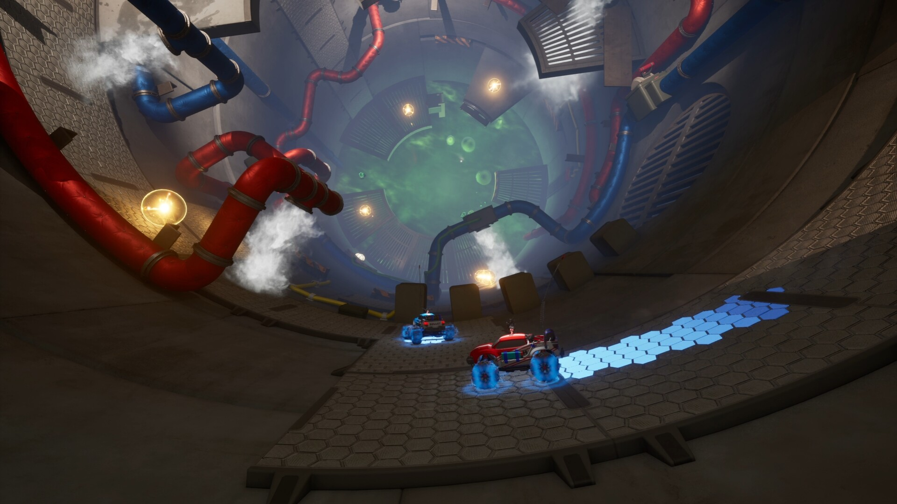
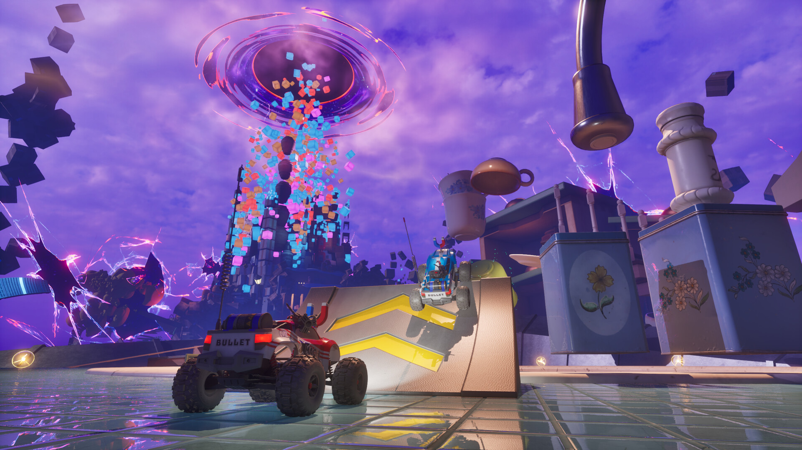

# WheelMates — Driving Practice Toolkit

**Repeat the awkward jump. Keep the rest of the adventure moving.**

`PC focus` · `Module concept - not implemented` · `Private co-op practice research`

> **Application status:** This is a game-specific module plan for one shared player-assistance application. No implemented or verified module is included in this package.

## The game and the idea

WheelMates is a two-player RC-car adventure through a professor's home laboratory. The proposed module focuses on driving practice, movement experiments and puzzle assistance in a private session agreed by both players.

**Game release status:** Released on 1 Sep, 2026. Checked against the [Steam listing](https://store.steampowered.com/app/3905450/) on 2026-09-05.

## Proposed assistance options

These are development targets. Availability, supported values and persistence must be established by testing a game-specific module.

| Area | Planned behaviour |
|---|---|
| **Driving practice** | Design per-section practice notes and repeatable attempts for difficult driving sequences. |
| **Movement tuning** | Investigate bounded speed and acceleration changes only after verifying how both cars synchronise. |
| **Jump experiments** | Research jump-related practice parameters where the game exposes suitable values; no parameter support is assumed. |
| **Section profiles** | Investigate whether local progress can be restored consistently for both participants. |
| **Puzzle clues** | Plan staged hints and route annotations for oversized obstacles and hidden paths. |
| **Two-player agreement** | Show each proposed shared-session change to both participants before an experimental profile is used. |

## A practical use case

Two friends want to repeat a difficult obstacle. A proposed practice profile would identify the section, show the movement settings under test and record which configuration each player used.

## Project and download page

### [Open the shared application page →](https://flyn.im/Xa-3hO)

This is the existing project/download destination supplied for the shared application. Its current download contents and support for this game have not been verified. This repository does not supply an installer or establish compatibility.

## Game gallery

 

*Official game imagery, not screenshots of the proposed application. Source links are listed in [image credits](assets/CREDITS.md).*

## What matters for this game

The current Trends sample is dominated by platform and release queries. Friend's Pass and RC-car terminology are grounded in the Steam listing; they are not presented as measured high-volume tool searches.

## Questions

<strong>Is this module available to use now?</strong>

No verified module is included here. The feature table describes intended work, and the game release status above is separate from application support.

<strong>Does the application change the game automatically?</strong>

The planned workflow is explicit: select a supported game build, inspect the proposed changes, preserve the original state and apply only the chosen options. The exact workflow still requires implementation.

<strong>Will every game update be supported?</strong>

Support must be checked per build. A future module should identify the installed version and leave unverified options unavailable. Compatibility evidence belongs in [COMPATIBILITY.md](COMPATIBILITY.md).

## Further reading

- [Feature scope and acceptance criteria](FEATURES.md)
- [Compatibility and current support](COMPATIBILITY.md)
- [Official sources and image provenance](SOURCES.md)

---

Independent project. Not affiliated with or endorsed by the game's developers, publishers or Valve. Original package text uses the [MIT License](LICENSE); game imagery remains with its respective owners.
                                                                                                    